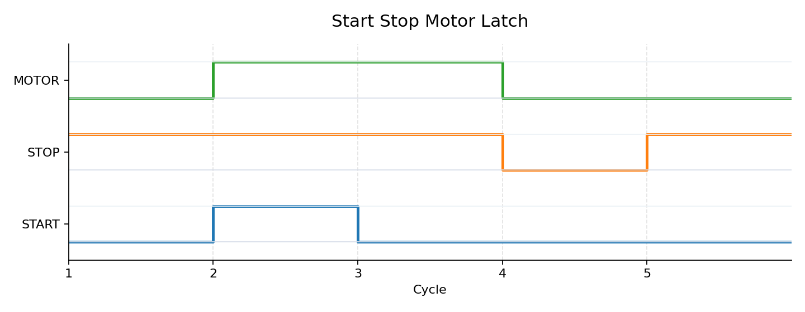
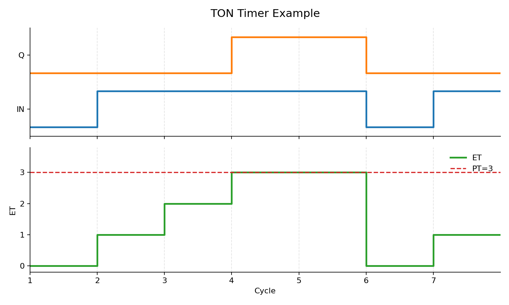

# PLC Scan Cycle Visualizer

[](https://github.com/tofelling/plc-scan-cycle-visualizer/releases)


[中文说明](docs/README.zh-CN.md) | English README

A beginner-friendly Python learning tool for visualizing how a PLC scan cycle turns input states into output states.

中文简介：这是一个面向自动化学生和 PLC 初学者的 Python 小工具，用来可视化 PLC 扫描周期如何把输入状态变成输出状态。

## Who Is This For? / 适合谁？

- Automation engineering students learning PLC basics.
- PLC beginners who know ladder logic terms but do not yet understand execution timing.
- Students preparing portfolio projects for internships or entry-level automation roles.
- Teachers or lab assistants who need small, hardware-free teaching examples.

中文总结：适合自动化专业学生、PLC 初学者，以及想用无硬件示例理解扫描周期的人。

## What Problem Does It Solve? / 解决什么问题？

Many students can recite the PLC scan cycle, but still feel confused by practical questions:

- Why does an input change not always affect an output immediately?
- Why can a start/stop latch keep a motor running after the start button is released?
- Why should stop and emergency stop conditions be placed carefully in control logic?
- Why does a PLC execute logic scan by scan instead of reacting like an ordinary interactive Python script?

This project is not an industrial PLC simulator. It is a small teaching tool focused on making the scan cycle visible.

中文总结：它把输入采样、程序执行、输出刷新、自锁和急停逻辑用日志与时序图展示出来。

## What Is a PLC Scan Cycle?

A PLC usually repeats three basic steps:

1. Input scan: read physical input states into memory.
2. Program execution: run the control logic using the stored input image.
3. Output update: write the computed output states to the real outputs.

The key idea is that logic is evaluated in repeated cycles. This timing model explains many beginner surprises in latch, interlock, and emergency stop examples.

## MVP Examples

The current version covers four fixed teaching cases:

v0.3 supports four fixed teaching scenarios: `single_button`, `start_stop_latch`, `emergency_stop`, and `ton_timer`.

| Example | Purpose |
|---|---|
| `01_single_button.yaml` | Show how one input button controls one output coil across scan cycles. |
| `02_start_stop_latch.yaml` | Show why a motor latch remains on after the start button is released. |
| `03_emergency_stop.yaml` | Show how an emergency stop condition overrides normal start logic. |
| `04_ton_timer.yaml` | Show how a TON timer accumulates elapsed time before Q becomes true. |

The current version uses fixed scenario logic, not a general ladder logic parser.

中文说明：当前版本只支持这四个固定教学场景，不是通用梯形图解析器。

## Quick Start / 快速开始

Install dependencies and run the start-stop latch example:

```bash
pip install -r requirements.txt
python main.py examples/02_start_stop_latch.yaml
```

You can also run `python main.py` to use the default start-stop latch example.

Generate a timing diagram for one example:

```bash
python main.py examples/02_start_stop_latch.yaml --plot
```

Generate timing diagrams for all MVP examples:

```bash
python main.py --plot-all
```

Run the TON timer example:

```bash
python main.py examples/04_ton_timer.yaml --plot
```

## v0.1 Output Example

The v0.1 output is a text-based scan cycle log. For the start-stop latch example, the output looks like this:

```text
Example: Start Stop Motor Latch
Description: Demonstrates how a motor latch holds its output across scan cycles.
Scenario type: start_stop_latch

Cycle 1
  Input scan: START=False, STOP=True
  Previous state: MOTOR=False
  Program execution: STOP is healthy, but START is not pressed and the latch was not active, so MOTOR stays off.
  Output update: MOTOR=False

Cycle 2
  Input scan: START=True, STOP=True
  Previous state: MOTOR=False
  Program execution: STOP is healthy and START is pressed, so MOTOR turns on.
  Output update: MOTOR=True

Cycle 3
  Input scan: START=False, STOP=True
  Previous state: MOTOR=True
  Program execution: START is released, but previous MOTOR was true, so the latch keeps MOTOR on.
  Output update: MOTOR=True

Cycle 4
  Input scan: START=False, STOP=False
  Previous state: MOTOR=True
  Program execution: STOP is false, meaning the stop circuit is broken, so MOTOR is forced off.
  Output update: MOTOR=False

Cycle 5
  Input scan: START=False, STOP=True
  Previous state: MOTOR=False
  Program execution: STOP is healthy, but START is not pressed and the latch was not active, so MOTOR stays off.
  Output update: MOTOR=False
```

v0.1 shows scan cycle logs. v0.2 adds timing diagrams that show how input and output signals change across scan cycles. v0.3 adds a basic TON timer teaching example.

## Timing Diagram Preview / 时序图预览

The timing diagram helps beginners see how `START`, `STOP`, and `MOTOR` change across scan cycles.

In this example, START is pressed only during Cycle 2, but MOTOR remains on in Cycle 3 because the latch uses the previous MOTOR state. When STOP becomes false in Cycle 4, MOTOR is forced off.

中文说明：在这个例子中，START 只在第 2 个扫描周期被按下，但 MOTOR 在第 3 个周期仍然保持开启，因为自锁逻辑使用了上一轮的 MOTOR 状态。当 STOP 在第 4 个周期变为 False 时，MOTOR 被强制关闭。



## TON Timer Preview

The TON timer diagram shows that `Q` does not become true immediately when `IN=True`. The timer must accumulate `ET` across continuous scan cycles until `ET` reaches `PT`.

中文说明：TON 延时定时器在 IN=True 后不会立刻 Q=True，而是需要在连续扫描周期中累计 ET。当 ET 达到 PT 后，Q 才变为 True；如果 IN=False，定时器复位。



## Practice Questions / 练习题

v0.4 adds beginner-friendly practice questions for all four examples. Learners can predict outputs before checking the answer and explanation.

中文说明：练习题会让你先预测某个扫描周期的输出，再查看答案和解释，适合用来巩固 PLC scan cycle、自锁、急停和 TON 定时器概念。

- [Single Button Practice](exercises/01_single_button_questions.md)
- [Start/Stop Latch Practice](exercises/02_start_stop_latch_questions.md)
- [Emergency Stop Practice](exercises/03_emergency_stop_questions.md)
- [TON Timer Practice](exercises/04_ton_timer_questions.md)
- [Practice Guide](docs/practice_guide.md)

## Core Logic / 核心逻辑

The start-stop latch example uses this teaching rule:

```text
MOTOR = STOP and (START or previous MOTOR)
```

Where:

- `STOP=True` means the stop circuit is healthy.
- `STOP=False` means the stop button is pressed or the stop circuit is broken.
- `previous MOTOR=True` allows the latch to hold after `START` is released.

This is fixed scenario logic for teaching scan cycles. It is not a full ladder logic interpreter.

中文说明：STOP=True 表示停止回路正常；previous MOTOR=True 表示上一轮电机已经开启，因此松开 START 后，MOTOR 仍然可以通过自锁逻辑保持开启。

## Project Roadmap

- v0.1: Display scan cycle logs for the three MVP examples. Implemented.
- v0.2: Generate timing diagrams from example data. Implemented.
- v0.3: Add a basic TON timer teaching example. Implemented.
- v0.4: Add practice questions and expected answers. Implemented.
- v1.0: Become a small, teachable, demo-ready PLC scan cycle learning tool.

See [roadmap.md](roadmap.md) for more detail.

## Why This Project Is Useful for Automation Students

This project connects classroom PLC concepts to visible behavior. Instead of only reading ladder diagrams, students can inspect how input states, internal logic, and output states change from scan to scan.

It is intentionally limited:

- No complete ladder editor.
- No complete IEC 61131-3 parser.
- No real PLC communication.
- No hardware connection.
- No complex GUI.

That narrow scope makes the project realistic for a student portfolio while still staying close to real automation concepts.

## Current Status / 当前状态

v0.4 implemented.

The repository can load the four YAML examples, print beginner-friendly scan cycle logs in the terminal, generate static timing diagram images, and provide practice questions with answers.

中文总结：当前版本已经包含四个教学案例、scan cycle logs、timing diagrams，以及配套练习题。
